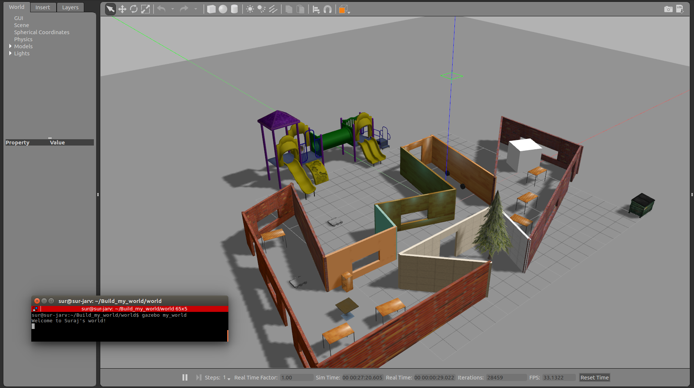

[](https://www.udacity.com/robotics)

# Udacity Nanodegree: Robotics Software Engineer

## Project 01: Build My World

### Directory Structure
```
. Build_my_world                  # Workspace directory
├── CMakeLists.txt                
├── docs                          # Results and notes
│   ├── my_world.png
│   ├── notes
│   └── with_output.png
├── LICENSE
├── model                          
│   ├── metal_hawk               # Model of robot
│   │   ├── model.config
│   │   └── model.sdf
│   └── my_building              # Model of environment
│       ├── model.config
│       └── model.sdf
├── README.md
├── script
│   └── welcome_message.cpp      # Gazebo World plugin C++ script
└── world
    └── my_world                 # Gazebo main World containing models

```

### Steps to launch the simulation

#### Step 1 Update and upgrade the Workspace image
```sh
$ sudo apt-get update
$ sudo apt-get upgrade -y
```

#### Step 2 Clone the lab folder in /home/workspace/
```sh
$ cd /home/workspace/
$ git clone git@github.com:Suraj0712/Build_my_world.git
```

#### Step 3 Compile the code
```sh
$ cd /home/workspace/Build_my_world/
$ mkdir build
$ cd build/
$ cmake ../
$ make
```

#### Step 4 Add the library path to the Gazebo plugin path  
```sh
$ export GAZEBO_PLUGIN_PATH=${GAZEBO_PLUGIN_PATH}:/home/workspace/Build_my_world/build
```

#### Step 5 Run the Gazebo World file  
```sh
$ cd /home/workspace/Build_my_world/world/
$ gazebo my_world
```


### Output
